# Blender Portfolio — Procedural 3D Art & Game Assets

Fully procedural 3D scenes and game assets generated with **Blender 5.0** and Python scripting. Every model, material, and light is created from code — no manual modeling required.

---

## Showcase — Environment Dioramas

### Extraction Beacon

A sci-fi extraction beacon — hexagonal platform, energy core, support pillars, cable routing, crate geometry, and cinematic studio lighting with depth of field.

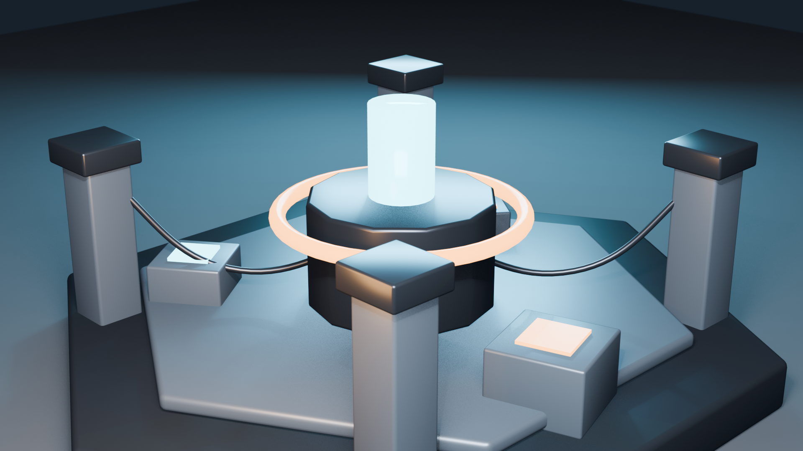

---

### Crystal Cavern

Underground cavern environment with emissive crystal formations, rocky domes, mineral pools, and atmospheric purple lighting.

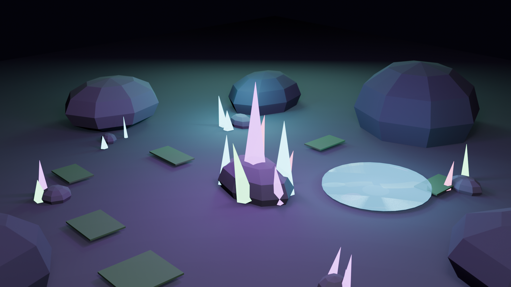

---

### Ancient Ruin

Overgrown stone archway with fluted columns, mossy accent pieces, scattered rubble, and warm lantern glow.

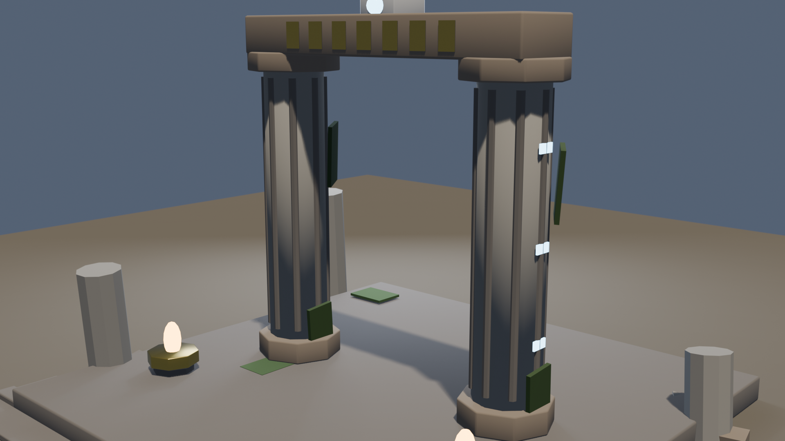

---

### Control Terminal

Retro-futuristic computer console with dual monitors, mechanical keyboard, status indicator lights, and a ventilated server base.

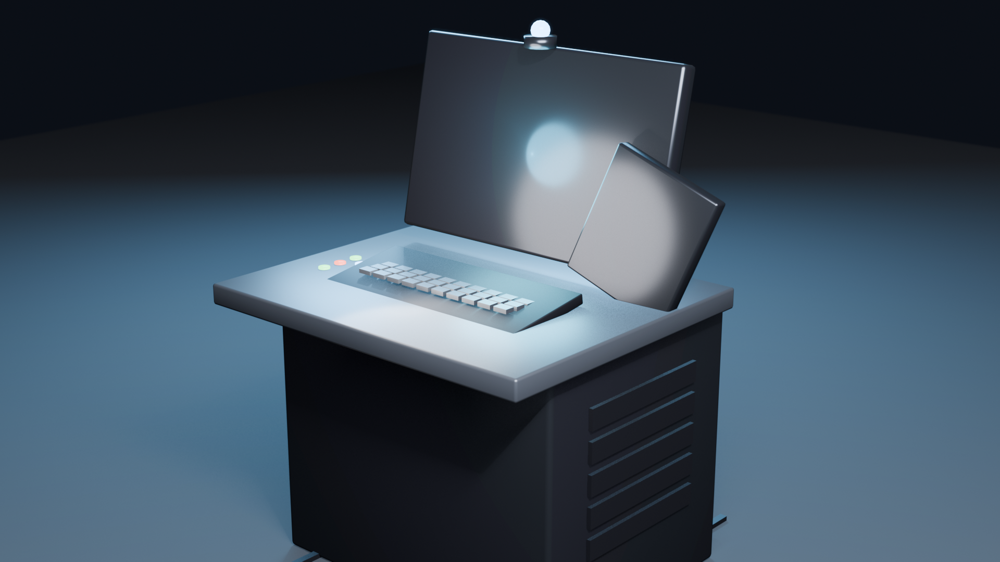

---

### Weapon Rack

Wall-mounted weapon display with bladed weapons, a shield, wall sconces, and warm interior lighting.

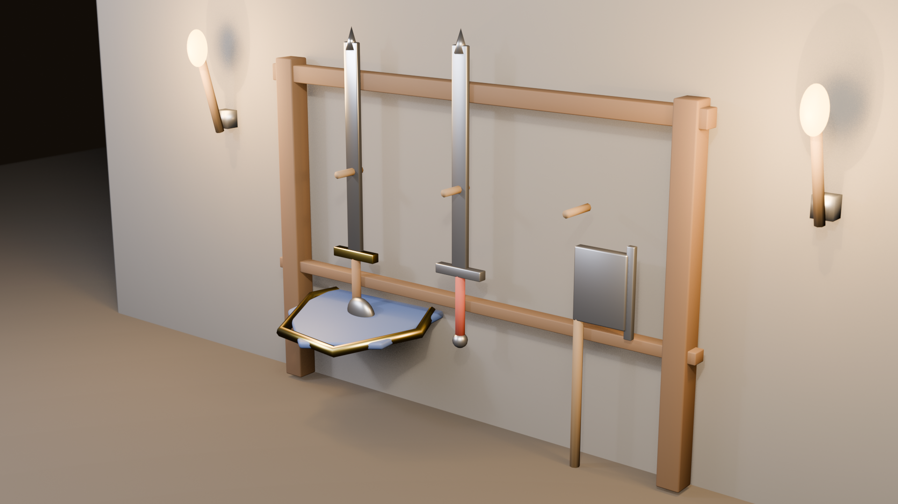

---

### Hover Drone

Quad-rotor surveillance drone with a metallic shell body, translucent rotor discs, antenna, and sensor dome.

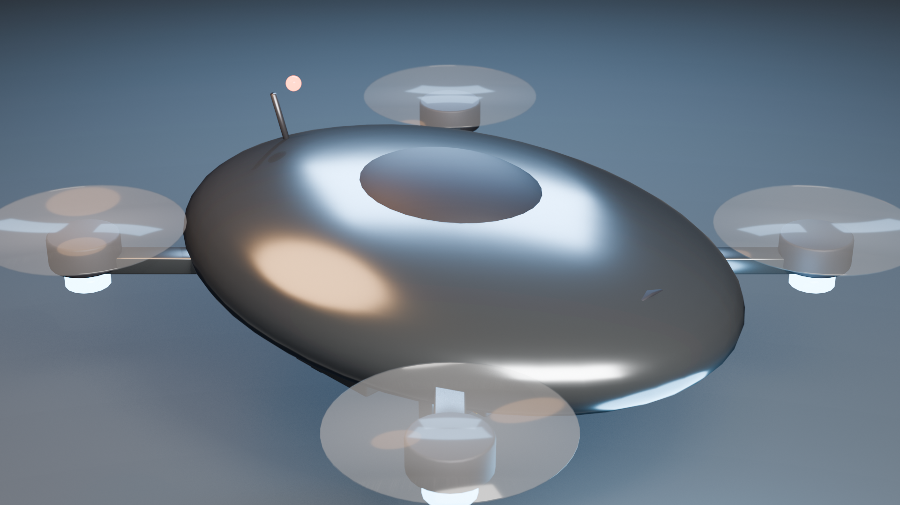

---

## Showcase — VoxelCraft Game Assets

Low-poly procedural models designed for [VoxelCraft: Core Runner](https://github.com/BrianDruciak/VoxelWorld), a Minecraft-style voxel sandbox built in Godot 4.6.

### Enemy Roster

| Thorn Crawler | Frost Wraith | Ember Golem | Void Stalker |
|:---:|:---:|:---:|:---:|
| 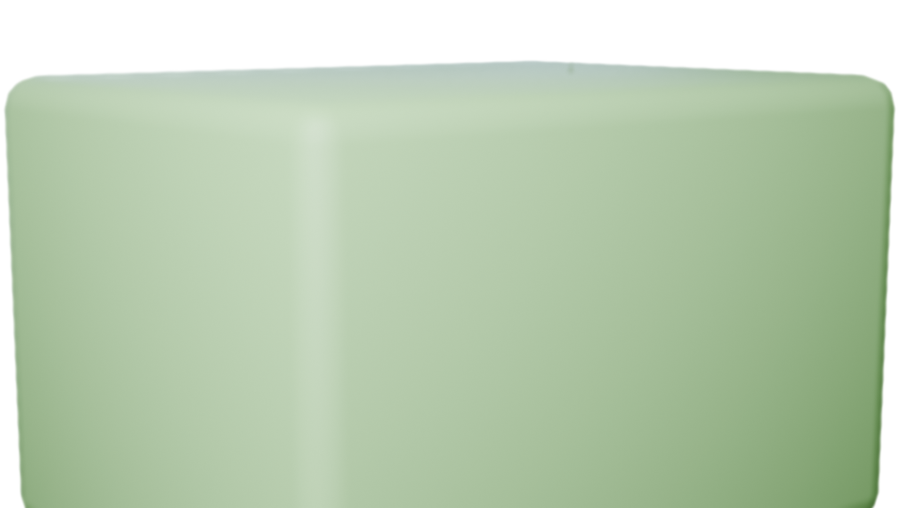 | 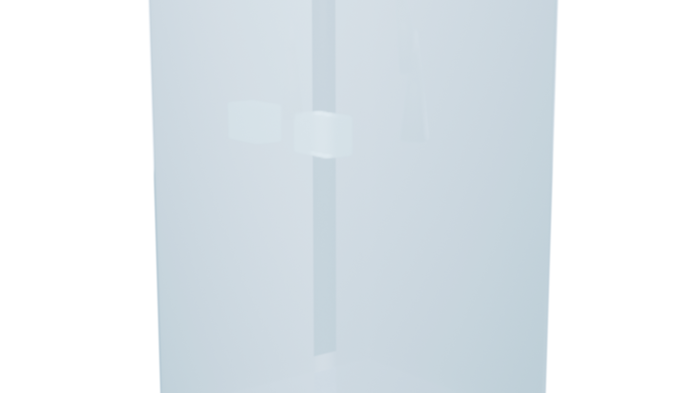 | 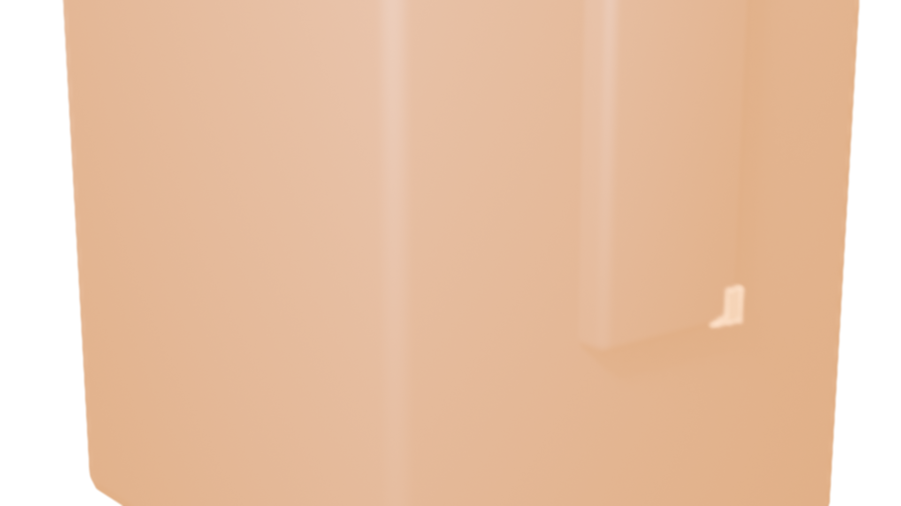 | 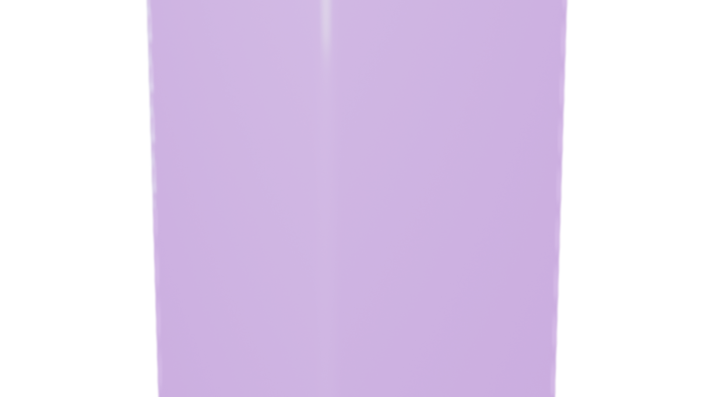 |
| Forest zone bruiser with spiked shell | Glacial zone phantom with ice shards | Volcanic zone tank with magma cracks | End-game wraith trailing void wisps |

### Crystal Pickups

Collectible ore crystals — each zone has a unique shard variant with emissive glow and point lighting.

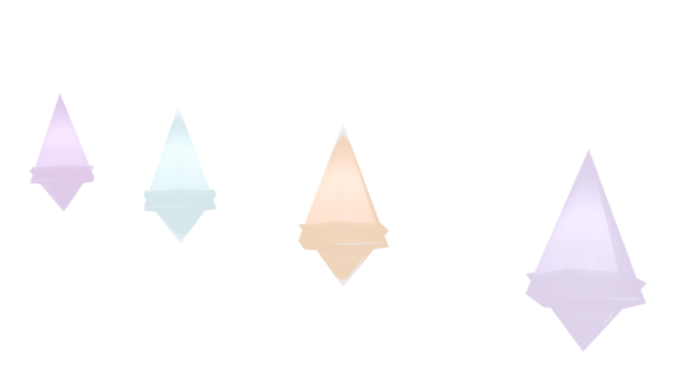

### Tool Tiers

Tiered pickaxe set progressing through the game's resource tree: Wood, Crystal, Frost, Ember, and Void.

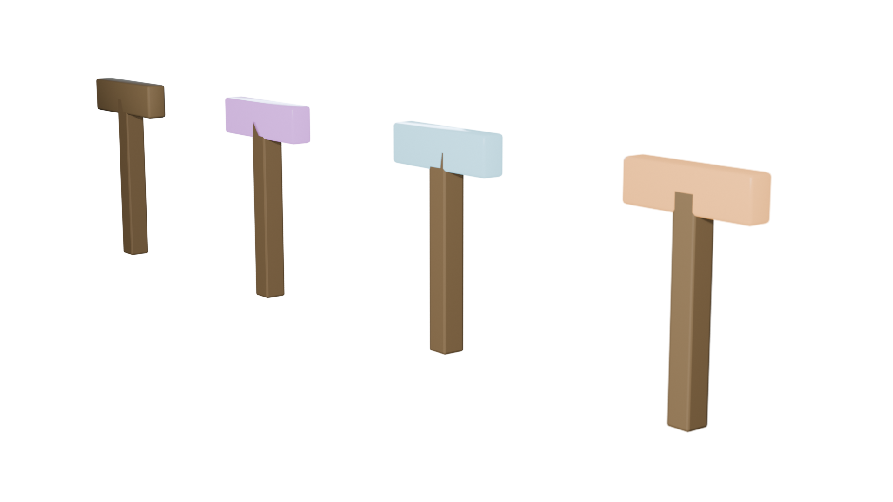

---

## Repo Structure

```
BlenderPortfolio/
├── scripts/                  # Blender Python source files
│   ├── extraction_beacon.py  # Sci-fi beacon diorama
│   ├── crystal_cavern.py     # Underground crystal cave
│   ├── ancient_ruin.py       # Overgrown stone archway
│   ├── control_terminal.py   # Retro-futuristic console
│   ├── weapon_rack.py        # Wall-mounted weapon display
│   ├── hover_drone.py        # Quad-rotor drone
│   └── game_assets.py        # Enemy, crystal, & tool generators
├── blend_files/              # Saved .blend scenes (Blender 5.0+)
│   ├── extraction_beacon.blend
│   ├── crystal_cavern.blend
│   ├── ancient_ruin.blend
│   ├── control_terminal.blend
│   ├── weapon_rack.blend
│   ├── hover_drone.blend
│   └── game_assets/
│       ├── enemy_thorn_crawler.blend
│       ├── enemy_frost_wraith.blend
│       ├── enemy_ember_golem.blend
│       ├── enemy_void_stalker.blend
│       ├── crystal_pickups.blend
│       └── tool_tiers.blend
└── renders/                  # Final PNG renders
    ├── extraction_beacon.png
    ├── crystal_cavern.png
    ├── ancient_ruin.png
    ├── control_terminal.png
    ├── weapon_rack.png
    ├── hover_drone.png
    └── game_assets/
        ├── enemy_thorn_crawler.png
        ├── enemy_frost_wraith.png
        ├── enemy_ember_golem.png
        ├── enemy_void_stalker.png
        ├── crystal_pickups.png
        └── tool_tiers.png
```

## Running the Scripts

Requires **Blender 5.0+** with Python `bpy` available.

```bash
# Render any environment diorama
blender --factory-startup -b -P scripts/extraction_beacon.py -- --samples 128
blender --factory-startup -b -P scripts/crystal_cavern.py -- --samples 128
blender --factory-startup -b -P scripts/ancient_ruin.py -- --samples 128
blender --factory-startup -b -P scripts/control_terminal.py -- --samples 128
blender --factory-startup -b -P scripts/weapon_rack.py -- --samples 128
blender --factory-startup -b -P scripts/hover_drone.py -- --samples 128

# Render all game assets
blender --factory-startup -b -P scripts/game_assets.py
```

## Tech Stack

- **Blender 5.0** — EEVEE Next renderer
- **Python 3.x** — `bpy`, `mathutils`
- Principled BSDF materials with emission, transparency, and metallic workflows
- Procedural geometry: bevels, smooth shading, hexagonal platforms, cable paths
- Studio lighting: area lights, point lights, depth of field

## License

MIT

## Author

**Brian Druciak** — [GitHub](https://github.com/BrianDruciak)
